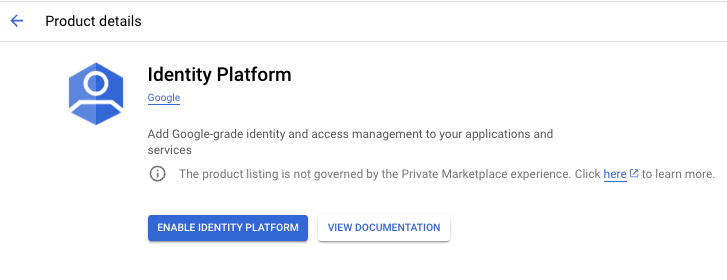
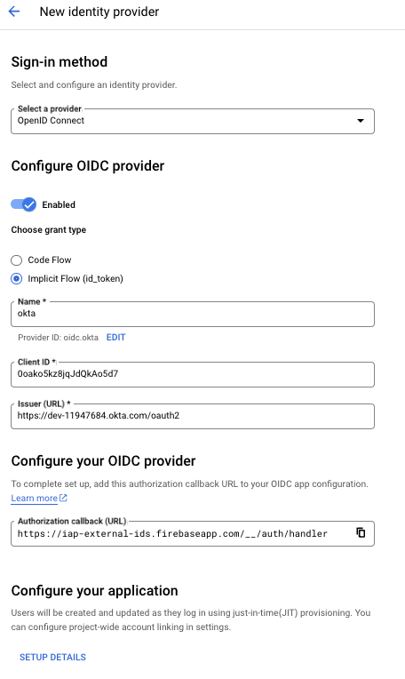
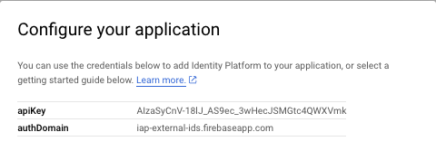
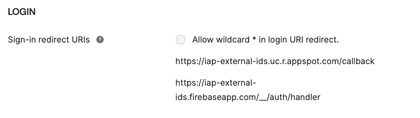
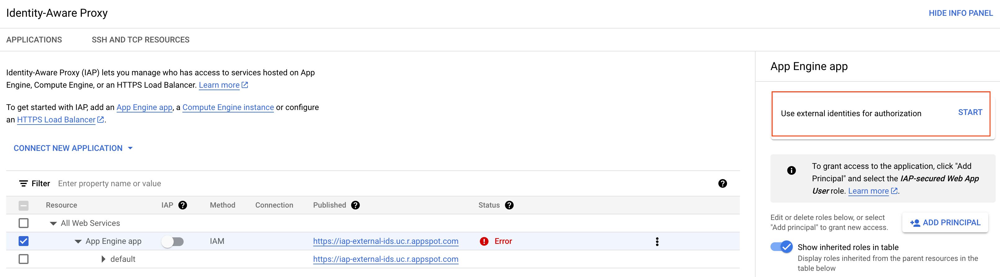
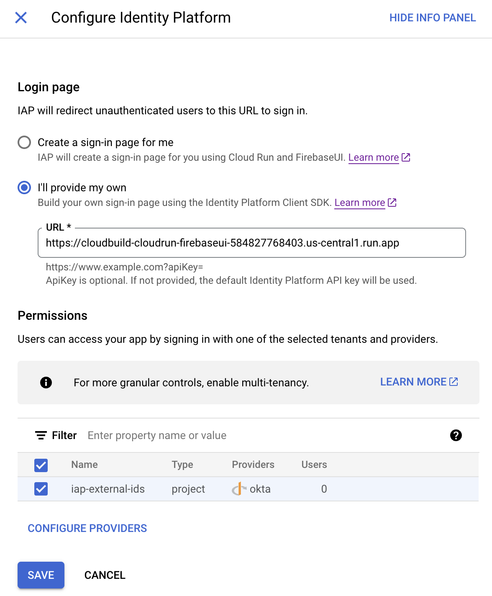
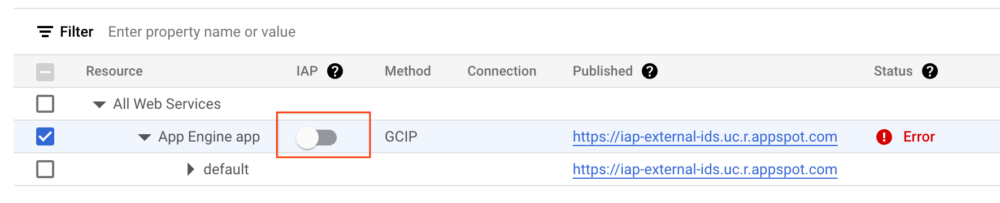
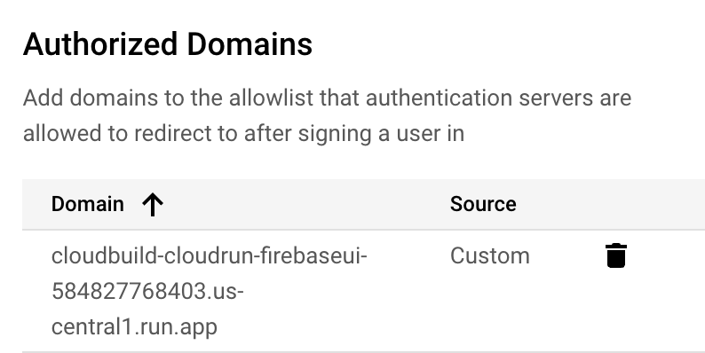

# IAP Protected Application Using FirebaseUI with External Identities

The steps below detail a method to establish an IAP protected App Engine site which allows access to [External Identities](https://cloud.google.com/iap/docs/enable-external-identities). In the case below, the identities come from a Cloud Identity Platform OIDC connection to Okta with the initial landing page showing the IAP JWT token received. Additionally, there is a link in the sample application which shows the results of a direct call to the IDP for the signed in user.
- https://cloud.google.com/iap/docs/enable-external-identities 
- https://cloud.google.com/iap/docs/using-firebaseui

There are two services which are deployable with this project.
- A Sample Application which:
    - Displays the result of the decoded IAP JWT payload, if available
    - Allows users to directly authenticate against the Okta IDP and displays the decoded JWT as sent by Okta
- A [FirebaseUI sign in page](https://cloud.google.com/iap/docs/using-firebaseui), which IAP uses to broker authentication between the IAP-protected Sample Application, the Cloud Identity Platform Services, and the Okta IDP

## Google Disclaimer
This is not an officially supported Google product

## Prerequisites
- An existing Google Project
- A free Okta account


## Enable Identity Platform and Configure Provider
Configure your identity provider as needed. Shown below is a potential configuration for a Custom OIDC connection with Okta. Additional documentation is available [here](https://cloud.google.com/iap/docs/authenticate-users-external-identities).

|     |      |
|:--- |----: |
|<ul type="square"><li>In your project, go to the [Identity Platform Marketplace](https://console.cloud.google.com/marketplace/details/google-cloud-platform/customer-identity) page in the Google Cloud console. Click Enable Identity Platform.</li></ul>|  |
|<ul type="square"><li>Complete the required fields based on your needs and the parameters provided by your IDP.</li><li>Note the "Authorized callback (URL)" as you'll likely need to add this as an authorized sign-in redirect URI with your IDP configuration</li></ul>|  |
|<ul type="square"><li>The "Setup Details" link above which will launch a pop-up that displays the necessary API_KEY and AUTH_DOMAIN fields you'll include as variables when deploying the FirebaseUI application.</li></ul>|  |


## IAP-Protected Sample Application
This sample application does two things:
1) Displays the result of the decoded IAP JWT payload, if available
1) Has a link to directly authenticate against the Okta IDP and display the decoded JWT as sent by Okta
    - If you want to do this, configure the following environment variales in the ./sample-app/app.yaml file:
        - BASE_URL: [Your App Engine URL] [background](https://cloud.google.com/appengine/docs/legacy/standard/python/how-requests-are-routed#urls)
        - CLIENT_ID: [Your IDP OIDC Application Client ID]
        - CLIENT_SECRET: [Your IDP OIDC Application Secret ID]
        - ISSUER_BASE_URL: [Your IDP OIDC Issuer URL]
        - SESSION_SECRET: [Express Web Server Session Secret] [background](https://expressjs.com/en/resources/middleware/session.html#secret)

```bash
#!/bin/bash
#Setup Variables
PROJECT_ID=[Google Project ID]
REGION=[Google Region]

cd sample-app/
gcloud config set project ${PROJECT_ID}
gcloud auth application-default set-quota-project ${PROJECT_ID}

printf 'y' |  gcloud services enable cloudidentity.googleapis.com
printf 'y' |  gcloud services enable cloudresourcemanager.googleapis.com
      
#App Engine
printf 'y' |  gcloud services enable appengine.googleapis.com
gcloud app create --project=$PROJECT_ID --region=$REGION

gcloud projects add-iam-policy-binding ${PROJECT_ID} \
    --member="serviceAccount:${PROJECT_ID}@appspot.gserviceaccount.com" \
    --role='roles/logging.logWriter'

gcloud projects add-iam-policy-binding ${PROJECT_ID} \
    --member="serviceAccount:${PROJECT_ID}@appspot.gserviceaccount.com" \
    --role='roles/artifactregistry.reader'

gcloud projects add-iam-policy-binding ${PROJECT_ID} \
    --member="serviceAccount:${PROJECT_ID}@appspot.gserviceaccount.com" \
    --role='roles/artifactregistry.createOnPushWriter'

gcloud storage buckets add-iam-policy-binding gs://staging.${PROJECT_ID}.appspot.com \
    --member="serviceAccount:${PROJECT_ID}@appspot.gserviceaccount.com" \
    --role='roles/storage.admin'

#You may need to wait a minute for permissions above to propogate to the newly created staging bucket
gcloud app deploy ./app.yaml --project=$PROJECT_ID
```
|     |      |
|:--- |----: |
|<ul type="square"><li>If you want to try this sample application without IAP protection, add the App Engine URL, with a '/callback' path, as an authorized Sign-in redirect URI in IDP configuration</li><li>/callback is the default path expected in the express-openid-connect used for the custom OIDC call to Okta outside of IAP</li><li>Additionally, add the URL, without the /callback path, as a valid Sign-out redirect URI in IDP configuration</li></ul>|  |

## FirebaseUI IAP Sign-in Page
- Update the firebaseui/src/main.js variables to match the settings obtained during the "Enable Identity Platform and Configure Provider" part of these instructions.
    - API_KEY=[authKey from Identity Platform Provider Setup] \
    - AUTH_DOMAIN=[authDomain from Identity Platform Provider Setup] \
    - PROVIDER=[Identity Platform Provider name, e.g. oidc.okta] \
    - PROVIDER_NAME=[Display name shown on sign-in page, e.g. Okta] \
    - SCOPES=[Additional scopes requested from IDP (comma separated), e.g. sample_app_scope,admin_scopes ] \

```bash
#!/bin/bash
#Setup Variables
PROJECT_ID=[Google Project ID]
REGION=[Google Region]
SERVICE_NAME="cloudbuild-cloudrun-firebaseui"
PROJECT_NUMBER=$(gcloud projects list \
    --filter="projectid=$PROJECT_ID" \
    --format="value(PROJECT_NUMBER)")

cd firebaseui/
gcloud config set project ${PROJECT_ID}
printf 'y' |  gcloud services enable run.googleapis.com
printf 'y' |  gcloud services enable cloudbuild.googleapis.com
printf 'y' |  gcloud services enable iap.googleapis.com

gcloud projects add-iam-policy-binding ${PROJECT_ID} \
  --member "serviceAccount:${PROJECT_NUMBER}-compute@developer.gserviceaccount.com" \
  --role "roles/storage.admin"

gcloud projects add-iam-policy-binding  ${PROJECT_ID} \
  --member "serviceAccount:${PROJECT_NUMBER}-compute@developer.gserviceaccount.com" \
  --role="roles/logging.logWriter"

gcloud projects add-iam-policy-binding  ${PROJECT_ID} \
  --member "serviceAccount:${PROJECT_NUMBER}-compute@developer.gserviceaccount.com" \
   --role='roles/artifactregistry.createOnPushWriter'

gcloud run deploy ${SERVICE_NAME} \
    --source . \
    --project=$PROJECT_ID \
    --region=$REGION \
    --allow-unauthenticated
```

## Configure IAP for External Identities
Once the Cloud Run deployment above has completed, you'll need the public URL of the Cloud Run instance. You'll need to initialize the OAuth Consent screen in the [console](https://console.cloud.google.com/auth/branding) or through the following commands.

```bash
OAUTH_TITLE="IAP Protected App Engine Example"

gcloud iap oauth-brands create \
    --application_title "${OAUTH_TITLE}"  \
    --support_email=$(gcloud config get core/account)
```

|     |      |
|:--- |----: |
|<ul type="square"><li>Navigate to the [IAP service](https://console.cloud.google.com/security/iap) in your project. Select "Start" to enable the use of external identities for authorization</li></ul>|  |
|<ul type="square"><li>Tell IAP that you now have your own sign-in page that you would like to use. Add the Cloud Run URL that was just deployed above. Detailed directions can be found in this [Enable External Identities](https://cloud.google.com/iap/docs/enable-external-identities#enabling_to_use_external_identities) documentation</li></ul>|  |
|<ul type="square"><li>Toggle on IAP for the Sample Application</li></ul>|  |
|<ul type="square"><li>Add the FirebaseUI Cloud Run domain to the "Authorized Domains" in your Identity Platform OIDC Provider configuration.</li><li>Additionally, ensure that "iap.googleapis.com" is included in the list. If not, add it.</li></ul>|  |
|<ul type="square"><li>Add the Firebase AUTH_DOMAIN from the start of this section, with a '\__/auth/handler' path, as an authorized sign-in redirect URI in your IDP configuration</li><li>__/auth/handler is the expected redirect endpoint for FirebaseUI and more details can be found [here](https://firebase.google.com/docs/auth/web/redirect-best-practices)</li></ul>|  |

### Example Decoded JWT Payloads

#### IAP Provided JWT Payload
```json
{
  "aud": "/projects/584828868403/apps/iap-external-ids",
  "azp": "/projects/584828868403/apps/iap-external-ids",
  "email": "securetoken.google.com/iap-external-ids:test.workforceidentity@external.com",
  "exp": 1739554300,
  "gcip": {
    "auth_time": 1739553700,
    "email": "test.workforceidentity@external.com",
    "email_verified": true,
    "firebase": {
      "identities": {
        "email": [
          "test.workforceidentity@external.com"
        ],
        "oidc.okta": [
          "00u6hm9e8sTFWECTb59s"
        ]
      },
      "sign_in_attributes": {
        "custom_family_name": "WorkforceIdentity",
        "custom_given_name": "Test",
        "idp": "00u6hm9e8sTFWECTb59s",
        "jti": "ID.a6NAh3rJw1uycBRjCqF2Jm5x8KqKFHRhRAlQn8LQfEI",
        "locale": "en_US",
        "preferred_username": "test.workforceidentity@external.com",
        "updated_at": 1738241882,
        "ver": 1,
        "zoneinfo": "America/Los_Angeles"
      },
      "sign_in_provider": "oidc.okta"
    },
    "name": "Test WorkforceIdentity",
    "sub": "MWhfgdkelqbZFaO5CNtpt2eiY682",
    "user_id": "MWhfgdkelqbZFaO5CNtpt2eiY682"
  },
  "iat": 1739553700,
  "identity_source": "GCIP",
  "iss": "https://cloud.google.com/iap",
  "sub": "securetoken.google.com/iap-external-ids:MWhfgdkelqbZFaO5CNtpt2eiY682"
}
```

#### Direct Okta IDP JWT Payload

```json
{
  "sub": "00u6hm9e8sTFWECTb59s",
  "name": "Test WorkforceIdentity",
  "locale": "en_US",
  "email": "test.workforceidentity@external.com",
  "ver": 1,
  "iss": "https://dev-11947684.okta.com/oauth2/default",
  "aud": "00u6hm9e8sTFWECTb59s",
  "iat": 1739552239,
  "exp": 1739555839,
  "jti": "ID.DPdXRxSIH8TJkjPsXkKBi2yqPdtpgkf2UIzhEn8Vup4",
  "amr": [
    "pwd"
  ],
  "idp": "00u6hm9e8sTFWECTb59s",
  "nonce": "nonce",
  "nickname": "Testy McTestFace_Okta",
  "preferred_username": "test.workforceidentity@external.com",
  "given_name": "Test",
  "family_name": "WorkforceIdentity",
  "zoneinfo": "America/Los_Angeles",
  "updated_at": 1738241882,
  "email_verified": true,
  "auth_time": 1000,
  "custom_family_name": "WorkforceIdentity",
  "custom_given_name": "Test"
}
```

### Additional Information:
- TODO: Existing FirebaseUI is 'popup' instead of 'redirect' which aligns with [this guidance](https://firebase.google.com/docs/auth/web/redirect-best-practices#signinwithpopup) since it's not hosted in Firebase, explore alternatives for making immediate redirects work outside of Firebase Hosting.
